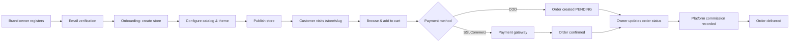
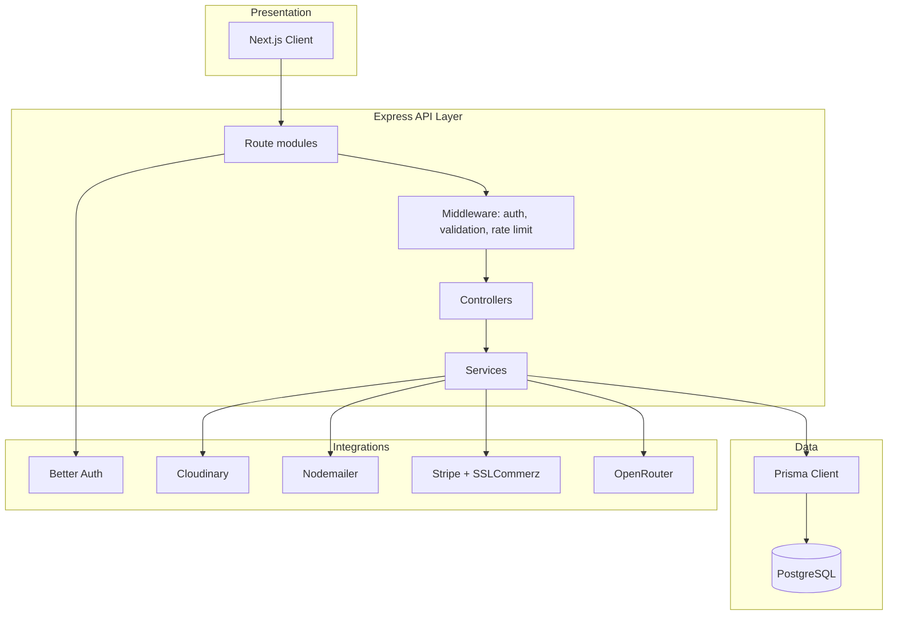
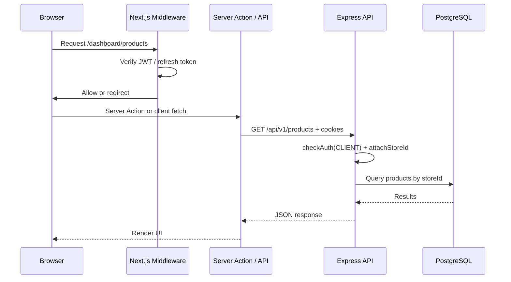

# Project Overview

[← Back to index](README.md)

## Purpose

**ModenixOS** is a multi-tenant SaaS platform that enables fashion brand owners to create, customize, and operate online stores. The platform provides:

- A **store-owner dashboard** for catalog, orders, customers, analytics, and billing
- **Public storefronts** at `/store/{slug}` with two visual themes
- A **platform admin panel** for store oversight, subscriptions, and commission management
- **Payment processing** for customer orders (SSLCommerz) and store subscriptions (Stripe or SSLCommerz)
- A **marketing chatbot** on the landing page powered by OpenRouter RAG

---

## Core features

### Platform (store owners — `CLIENT` role)

| Area | Capabilities |
|------|--------------|
| **Onboarding** | Create a store with brand name, slug, country, currency |
| **Catalog** | Products (with variants, images, details JSON), categories (hierarchical), collections |
| **Commerce** | Orders, customers, reviews (moderation), coupons |
| **Store customization** | Branding, theme (theme1/theme2), header, pages, shipping, appearance |
| **Analytics** | Overview and charts (advanced analytics gated by plan) |
| **Team** | Invite store members (`ADMIN`, `STAFF`, `VIEWER` roles) |
| **Billing** | Subscribe to Growth (`PRO`) plan via Stripe or SSLCommerz |

### Public storefront (end customers)

| Area | Capabilities |
|------|--------------|
| **Browsing** | Home, shop, categories, collections, product detail |
| **Checkout** | Cart, checkout, COD or SSLCommerz online payment |
| **Account** | Register, login, OTP login/register, wishlist, order history |
| **Policies** | About, contact, privacy, shipping, return, payment-refund pages |
| **Order tracking** | Track by order number + email (no login required) |

### Platform admin (`ADMIN` / `SUPER_ADMIN`)

| Area | Capabilities |
|------|--------------|
| **Stores** | List stores, suspend/unsuspend |
| **Users** | List platform users |
| **Analytics** | Platform-wide analytics |
| **Subscriptions** | View and override store plans |
| **Billing** | Billing analytics, failed payments |
| **Commission** | Configure platform commission, view earnings and analytics |
| **Admin management** | Create admin accounts (`SUPER_ADMIN` only) |

### Marketing

| Area | Capabilities |
|------|--------------|
| **Landing page** | Public marketing site at `/` |
| **Demo** | Demo page at `/demo` |
| **Chatbot** | RAG chatbot at `/api/v1/public/chat` (when `OPENROUTER_API_KEY` is set) |

---

## Business workflow

### Subscription workflow (store owner)

1. Store starts on **FREE** (Starter) plan — up to 50 products, no coupons
2. Owner upgrades to **PRO** (Growth) via Stripe checkout or SSLCommerz
3. Webhook/callback activates subscription and syncs `store.plan`
4. Owner gains unlimited products, coupons, advanced analytics, custom branding

---

## User roles

### Platform roles (`User.role`)

| Role | Description | Default route |
|------|-------------|---------------|
| `CLIENT` | Store owner or store team member | `/dashboard` |
| `ADMIN` | Platform administrator | `/admin/dashboard` |
| `SUPER_ADMIN` | Full platform access + admin provisioning | `/admin/dashboard` |

### Store member roles (`StoreMember.role`)

| Role | Stored in DB | Enforced in API |
|------|--------------|-----------------|
| `OWNER` | Implicit (store `ownerId`) | Billing requires owner |
| `ADMIN` | Yes | **Not enforced** on catalog/order routes |
| `STAFF` | Yes | **Not enforced** |
| `VIEWER` | Yes | **Not enforced** |

> See [Known Limitations](15-known-limitations.md) — store member role permissions are modeled but not fully enforced server-side.

### Storefront customers

Separate from platform users. Authenticated via per-store JWT cookies (`storefront_customer_{slug}`). Scoped to a single store.

---

## Architecture overview

### Request flow (authenticated dashboard action)

---

## Related documentation

- [Tech Stack](02-tech-stack.md)
- [Authentication](07-authentication.md)
- [Business Logic](09-business-logic.md)
- [API Documentation](08-api-documentation.md)
