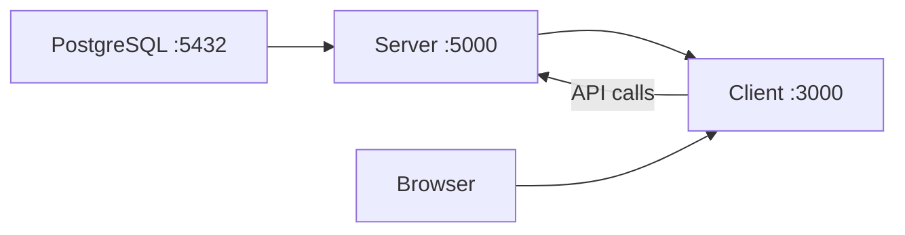

# Installation Guide

[← Back to index](README.md)

## Prerequisites

| Requirement | Version | Notes |
|-------------|---------|-------|
| Node.js | 20+ | |
| npm | Latest | |
| PostgreSQL | 14+ | Local or hosted |
| Cloudinary account | — | Image uploads |
| SMTP credentials | — | OTP emails |
| Google OAuth credentials | Optional | Google login |
| Stripe account | Optional | Subscription billing (USD) |
| SSLCommerz account | Optional | Order payments and BDT billing |
| OpenRouter API key | Optional | Marketing chatbot |

---

## Clone

```bash
git clone <your-modenixos-server-repo-url>
cd modenixos-server
```

---

## Server installation

### 1. Install dependencies

```bash
cd modenixos-server
npm install
```

### 2. Environment setup

```bash
cp .env.example .env
```

Edit `.env` with your values. See [Environment Variables](04-environment-variables.md) for every variable.

**Minimum required:** All variables listed in `src/config/env.ts` `requiredEnvVariables` array must be set or the server will fail at startup.

### 3. Database migration

Create a PostgreSQL database, then:

```bash
npm run db:migrate
```

For production:

```bash
npm run db:migrate:deploy
```

### 4. Seed (optional)

| Script | Command | Purpose |
|--------|---------|---------|
| Super Admin | Automatic on startup | Uses `SUPER_ADMIN_EMAIL` / `SUPER_ADMIN_PASSWORD` |
| Demo data | `npm run seed:demo` | Demo store `luxe-threads`, products, orders |
| Chatbot knowledge | `npm run chatbot:seed` | Seed RAG knowledge chunks |

Demo credentials (from `scripts/seed-demo.ts`):

- Email: `demo@modenixos.com`
- Password: `demo123456`
- Store slug: `luxe-threads`

### 5. Development

```bash
npm run dev
```

Server runs at **http://localhost:5000**

### 6. Production build

```bash
npm run build
npm start
```

Build steps (`package.json`):

1. `prisma generate`
2. `tsc` compile to `dist/`
3. Copy generated Prisma client
4. Fix ESM import paths

---

## Client (companion app)

The Next.js frontend is documented separately:

The Next.js frontend is documented in the **`modenixos-client`** repository (`docs/03-installation.md`).

---

## Running server + client together



1. Start PostgreSQL
2. Start this server: `npm run dev`
3. Start the client from the **`modenixos-client`** repo: `pnpm dev`
4. Open http://localhost:3000
5. Log in with Super Admin credentials from `.env`, or register a new client account

---

## Verify installation

| Check | URL / command |
|-------|---------------|
| Server root | `GET http://localhost:5000/` → `{APP_NAME} Server is running` |
| Health | `GET http://localhost:5000/health` → `{ status: "ok", database: "connected" }` |
| Client | `http://localhost:3000` → landing page |
| Prisma Studio | `npm run db:studio` (server directory) |

---

## Related documentation

- [Environment Variables](04-environment-variables.md)
- [Deployment Guide](11-deployment.md)
- [Troubleshooting](14-troubleshooting.md)
