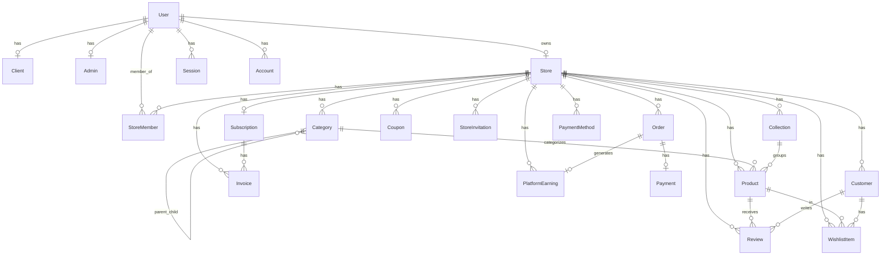

# Database

[← Back to index](README.md)

ModenixOS uses **PostgreSQL** with **Prisma 7** ORM. The schema is split across multiple files in `modenixos-server/prisma/schema/`.

---

## Entity relationship diagram

---

## Models

### Authentication (`auth.prisma`)

#### User

| Field | Type | Notes |
|-------|------|-------|
| `id` | UUID | Primary key |
| `name`, `email` | String | Email unique |
| `emailVerified` | Boolean | Default `false` |
| `role` | `Role` | Default `CLIENT` |
| `status` | `UserStatus` | Default `ACTIVE` |
| `needPasswordChange` | Boolean | Forces password reset |
| `isDeleted`, `deletedAt` | Boolean, DateTime? | Soft delete |
| `image` | String? | Avatar URL |
| `lastLogin`, `lastIpAddress`, `lastUserAgent` | — | Login tracking |
| `failedLoginAttempts`, `lockedUntil` | — | Account lockout fields |

**Relations:** `accounts`, `sessions`, `client`, `admin`, `store`, `storeMemberships`, `storeInvitationsSent`

#### Session

Better Auth session storage. Indexed on `userId`. Cascade delete with user.

#### Account

OAuth and credential provider data. Indexed on `userId`.

#### Verification

OTP and verification tokens. Indexed on `identifier`.

---

### Profiles

#### Client (`client.prisma`)

Store owner profile: `name`, `email`, `profilePhoto`, `contactNumber`, `address`, `gender`.

#### Admin (`admin.prisma`)

Platform admin profile: `name`, `email`, `profilePhoto`, `contactNumber`.

---

### Store (`store.prisma`)

| Field | Type | Notes |
|-------|------|-------|
| `ownerId` | UUID | Unique — one store per owner |
| `brandName`, `slug` | String | Slug unique, indexed |
| `logo`, `logoDark`, `banner` | String? | Image URLs |
| `country`, `currency` | String | Currency default `USD` |
| `description` | String? | |
| `isPublished` | Boolean | Default `false` |
| `isSuspended` | Boolean | Admin can suspend |
| `plan` | `StorePlan` | Default `FREE` |
| `theme`, `shipping` | Json? | Storefront customization |

**Indexes:** `slug`, `isPublished`

---

### Catalog (`catalog.prisma`)

#### Category

Hierarchical via `parentId` self-relation. Unique `[storeId, slug]`.

#### Collection

Featured flag, sort order. Unique `[storeId, slug]`.

#### Product

| Notable fields | Description |
|----------------|-------------|
| `price`, `discountPrice` | Pricing |
| `images`, `sizes`, `colors`, `tags` | String arrays |
| `details` | Json — variants, specs, SEO, etc. |
| `status` | `DRAFT`, `ACTIVE`, `ARCHIVED` |
| `sortOrder` | Manual ordering |

---

### Commerce

#### Order (`order.prisma`)

| Field | Notes |
|-------|-------|
| `orderNumber` | Unique per store |
| `items` | Json array of line items |
| `shippingAddress` | Json |
| `paymentMethod` | Default `COD` |
| `trackingNumber`, `trackingCarrier` | Fulfillment |
| `subtotal`, `shipping`, `discount`, `total` | Float amounts |

#### Customer (`customer.prisma`)

Per-store customer records. `addresses` stored as Json array. Unique `[storeId, email]`.

#### WishlistItem

Unique `[customerId, productId]`.

#### Review

Supports registered customers or guests (`guestName`, `guestEmail`). Status workflow: `PENDING` → `APPROVED` / `REJECTED`.

#### Coupon

Types: `PERCENT`, `FIXED`. Unique `[storeId, code]`.

---

### Team (`store-member.prisma`)

#### StoreMember

Unique `[storeId, userId]`. Roles: `ADMIN`, `STAFF`, `VIEWER`.

#### StoreInvitation

Token-based invites with expiry. Status: `PENDING`, `ACCEPTED`, `REVOKED`, `EXPIRED`.

---

### Billing (`billing.prisma`)

#### Subscription

One per store. Stripe IDs for customer and subscription. Status: `TRIALING`, `ACTIVE`, `PAST_DUE`, `CANCELLED`, `EXPIRED`.

#### PaymentMethod

Stripe payment method references per store.

#### Invoice

Supports Stripe and SSLCommerz (`provider`, `transactionId`, `validationId`, `gatewayResponse`).

---

### Payments (`payment.prisma`)

#### Payment

One-to-one with Order. SSLCommerz order payments. Status: `PENDING`, `PAID`, `FAILED`, `CANCELLED`, `REFUNDED`.

---

### Commission (`commission.prisma`)

#### PlatformSettings

Singleton (`id: "default"`). Commission type (`PERCENT`/`FIXED`), value, base (`SUBTOTAL`/`TOTAL`), trigger status.

#### PlatformEarning

One per order. Status: `EARNED`, `REVERSED`.

---

### Chatbot (`chatbot.prisma`)

#### ChatbotKnowledgeChunk

RAG knowledge with `embedding` stored as Json. Unique `sourceKey`.

---

## Enums (`enums.prisma`)

| Enum | Values |
|------|--------|
| `Role` | `CLIENT`, `ADMIN`, `SUPER_ADMIN` |
| `UserStatus` | `ACTIVE`, `INACTIVE`, `SUSPENDED`, `DELETED` |
| `Gender` | `MALE`, `FEMALE`, `OTHER` |
| `StorePlan` | `FREE`, `PRO`, `ENTERPRISE` |
| `ProductStatus` | `DRAFT`, `ACTIVE`, `ARCHIVED` |
| `OrderStatus` | `PENDING`, `CONFIRMED`, `PACKED`, `SHIPPED`, `DELIVERED`, `CANCELLED` |
| `CouponType` | `PERCENT`, `FIXED` |
| `ReviewStatus` | `PENDING`, `APPROVED`, `REJECTED` |
| `StoreMemberRole` | `ADMIN`, `STAFF`, `VIEWER` |
| `StoreInvitationStatus` | `PENDING`, `ACCEPTED`, `REVOKED`, `EXPIRED` |
| `SubscriptionStatus` | `TRIALING`, `ACTIVE`, `PAST_DUE`, `CANCELLED`, `EXPIRED` |
| `InvoiceStatus` | `DRAFT`, `OPEN`, `PAID`, `VOID`, `UNCOLLECTIBLE` |
| `PaymentStatus` | `PENDING`, `PAID`, `FAILED`, `CANCELLED`, `REFUNDED` |
| `CommissionType` | `PERCENT`, `FIXED` |
| `CommissionBase` | `SUBTOTAL`, `TOTAL` |
| `PlatformEarningStatus` | `EARNED`, `REVERSED` |

---

## Indexes and constraints (summary)

| Model | Constraint / Index |
|-------|-------------------|
| `User` | Unique `email` |
| `Store` | Unique `ownerId`, `slug`; index `slug`, `isPublished` |
| `Category` | Unique `[storeId, slug]`; index `storeId`, `parentId`, `[storeId, parentId, sortOrder]` |
| `Collection` | Unique `[storeId, slug]`; index `[storeId, sortOrder]` |
| `Product` | Index `storeId`, `categoryId`, `collectionId`, `status`, `[storeId, sortOrder]` |
| `Order` | Unique `[storeId, orderNumber]`; index `storeId`, `status`, `customerEmail` |
| `Customer` | Unique `[storeId, email]` |
| `WishlistItem` | Unique `[customerId, productId]` |
| `Coupon` | Unique `[storeId, code]` |
| `StoreMember` | Unique `[storeId, userId]` |
| `StoreInvitation` | Unique `token` |
| `Subscription` | Unique `storeId`; unique Stripe IDs |
| `Payment` | Unique `orderId`, `transactionId` |
| `PlatformEarning` | Unique `orderId` |
| `ChatbotKnowledgeChunk` | Unique `sourceKey` |

---

## Migrations

Migrations live in `modenixos-server/prisma/migrations/`. Notable migration timeline:

| Migration | Addition |
|-----------|----------|
| `20260612094009_ini` | Initial schema |
| `20260704110549_add_modenixos_models` | Core ModenixOS models |
| `20260705092911_add_product_details_wishlist` | Product details, wishlist |
| `20260705100000_add_order_tracking_fields` | Order tracking |
| `20260705220000_add_store_members` | Store team |
| `20260706090000_add_billing` | Subscriptions, invoices |
| `20260706100000_add_payments` | Order payments |
| `20260706110000_billing_ssl_provider` | SSL billing provider |
| `20260706163000_add_chatbot_knowledge` | Chatbot RAG |
| `20260706170000_add_platform_commission` | Platform commission |

---

## Related documentation

- [Authentication](07-authentication.md)
- [Business Logic](09-business-logic.md)
- [Backup & Recovery](12-backup-recovery.md)
