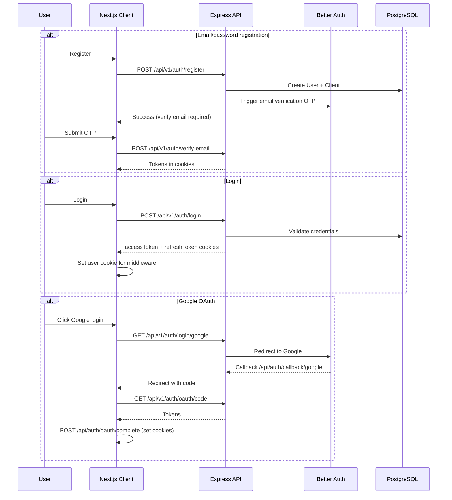
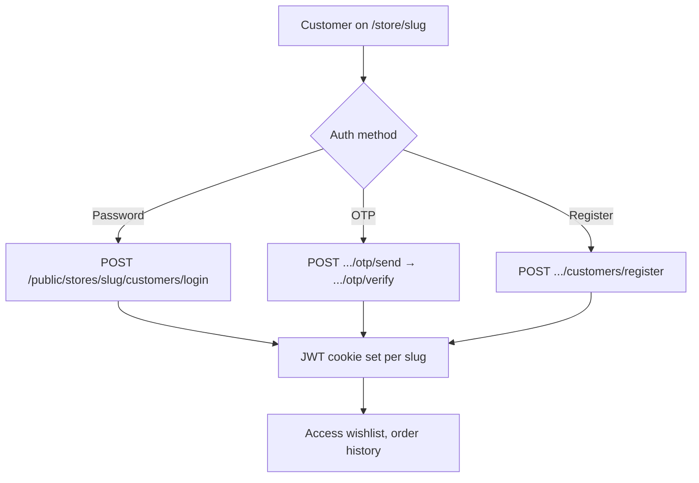

# Authentication & Authorization

[← Back to index](README.md)

ModenixOS implements **three separate authentication domains**:

1. **Platform users** (store owners, admins) — JWT + Better Auth sessions
2. **Storefront customers** — per-store JWT cookies
3. **Better Auth native handler** — OAuth callbacks and session management

---

## Platform authentication flow

### Cookies set on login

| Cookie | Purpose |
|--------|---------|
| `accessToken` | JWT for API auth (HTTP-only) |
| `refreshToken` | JWT for token refresh (HTTP-only) |
| `better-auth.session_token` | Better Auth session fallback |
| `user` | Non-sensitive user info for client middleware (client-side readable) |

### Token verification (`checkAuth` middleware)

1. Read `accessToken` cookie → verify with `ACCESS_TOKEN_SECRET`
2. If valid: load user from DB, check `status`, `isDeleted`, role
3. If invalid/missing: fall back to `better-auth.session_token` → DB session lookup
4. If session expiring (< 20% lifetime): set `X-Session-Refresh` headers

### Client middleware (`proxy.ts`)

- Verifies JWT using `ACCESS_TOKEN_SECRET` (must match server)
- Auto-refreshes tokens when expiring within 60 seconds
- Enforces role-based routing and email verification / password change gates
- Redirects `CLIENT` users without a store to `/onboarding`

---

## Authorization

### Platform roles

| Role | API access | Client routes |
|------|------------|---------------|
| `CLIENT` | `/api/v1/stores`, catalog, orders, billing (owner), etc. | `/dashboard/*` |
| `ADMIN` | `/api/v1/admin/*` | `/admin/*` |
| `SUPER_ADMIN` | All `ADMIN` routes + `POST /api/v1/users/create-admin` | `/admin/*` |

### Route protection patterns (server)

| Middleware | Used on | Requirement |
|------------|---------|-------------|
| `checkAuth(Role.CLIENT)` | Store creation, member management | Platform CLIENT role |
| `checkAuth(Role.CLIENT) + attachStoreId` | Products, orders, etc. | CLIENT with store access |
| `checkAuth(Role.CLIENT) + attachStoreOwner` | Billing | Store **owner** only |
| `checkAuth(Role.ADMIN, Role.SUPER_ADMIN)` | Admin routes | Platform admin |
| `checkAuth(...allRoles)` | `/auth/me`, profile | Any authenticated platform user |
| `requireStorefrontCustomer` | Storefront orders, wishlist | Per-store customer JWT |
| `resolvePublicStore` | Public store routes | Valid published store slug |

### Store access resolution (`storeAccess.ts`)

1. If user owns a store → `role: "OWNER"`
2. Else if `StoreMember` record exists → member's `StoreMemberRole`
3. Else → no access (404 on dashboard routes)

### Store member roles (database vs enforcement)

| Role | Intended purpose | Currently enforced |
|------|------------------|-------------------|
| `OWNER` | Full store control | Yes (billing only explicitly) |
| `ADMIN` | Team admin | **No** — same API access as owner for catalog/orders |
| `STAFF` | Operational access | **No** |
| `VIEWER` | Read-only | **No** |

`req.storeRole` is set by `attachStoreId` but **not checked** in route handlers.

---

## Storefront customer authentication

Separate from platform auth. Uses cookie name `storefront_customer_{slug}`.

Middleware: `requireStorefrontCustomer` / `optionalStorefrontCustomer` in `storefrontCustomerAuth.ts`.

---

## Password flows

| Flow | Endpoint | Auth |
|------|----------|------|
| Forgot password | `POST /api/v1/auth/forget-password` | Public (rate limited) |
| Reset password | `POST /api/v1/auth/reset-password` | Public (OTP) |
| Change password | `POST /api/v1/auth/change-password` | Authenticated |
| Force reset | `needPasswordChange` flag → client redirects to `/reset-password` | — |

---

## Rate limiting

| Limiter | Routes | Limit (production) |
|---------|--------|-------------------|
| `credentialAuthLimiter` | login, register, verify-email, forget/reset password | 20 / 15 min |
| `betterAuthLimiter` | `/api/auth/*` | 200 / 15 min |
| `chatbotLimiter` | `POST /public/chat` | 60 / 15 min |

Development mode skips credential and Better Auth limiters.

---

## Permissions matrix (implemented)

| Action | CLIENT (owner) | CLIENT (member) | ADMIN | SUPER_ADMIN | Storefront customer |
|--------|----------------|-----------------|-------|-------------|---------------------|
| Manage own store catalog | Yes | Yes* | No | No | No |
| Manage billing | Yes | No | No | No | No |
| Platform admin APIs | No | No | Yes | Yes | No |
| Create admin users | No | No | No | Yes | No |
| Place storefront order | No | No | No | No | Yes (guest or logged in) |
| Wishlist | No | No | No | No | Yes (logged in) |

\*Member roles not differentiated in API — see [Known Limitations](15-known-limitations.md).

---

## Related documentation

- [API Documentation](08-api-documentation.md)
- [Security](13-security.md)
- [Business Logic](09-business-logic.md)
