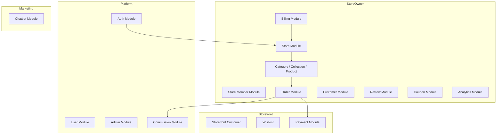
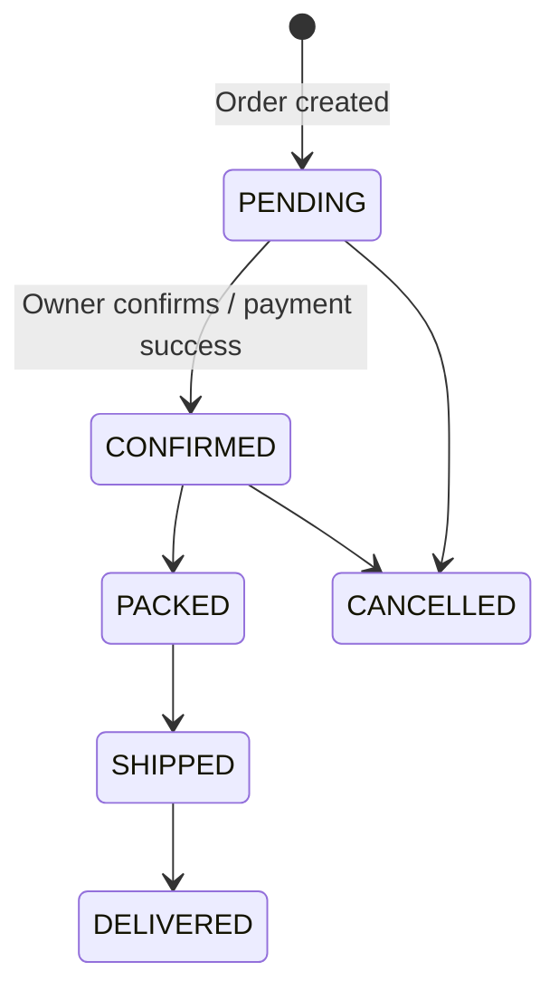

# Business Logic

[← Back to index](README.md)

## Module overview

---

## Store lifecycle

1. **Registration** — `CLIENT` user registers and verifies email
2. **Onboarding** — `POST /stores` creates store with unique `slug` (one store per owner)
3. **Configuration** — Owner sets branding, theme (`theme1` or `theme2`), shipping rules, publishes store
4. **Operations** — Manage catalog, fulfill orders, moderate reviews
5. **Growth** — Upgrade plan for coupons, unlimited products, advanced analytics

### Store visibility

`StoreService.getPublicStoreBySlug`:
- Published stores are public
- Unpublished stores visible only to the owner (preview mode via `optionalCheckAuth`)
- Suspended stores return 403

---

## Catalog management

### Products

- Status workflow: `DRAFT` → `ACTIVE` → `ARCHIVED`
- Rich `details` JSON: variants, size charts, SEO fields, color-specific images
- Images uploaded via Multer → Cloudinary
- Manual sort order via `/reorder` endpoint
- **Plan limit:** FREE plan capped at 50 products (`planEnforcement.ts`)

### Categories

- Hierarchical (`parentId` self-reference)
- Slug unique per store
- Sort order support

### Collections

- Group products for storefront sections
- `isFeatured` flag for homepage display

---

## Order processing

### Payment methods

| Method | Flow |
|--------|------|
| `COD` | Order created directly with `PENDING` status |
| `SSLCOMMERZ` | `POST /public/stores/:slug/payment/create` → gateway redirect → callbacks update `Payment` and order |

### Order tracking

Public tracking via `GET /orders/track?orderNumber=&email=` — no login required.

---

## Review moderation

1. Customer or guest submits review → status `PENDING`
2. Owner approves/rejects via dashboard → `APPROVED` reviews appear on storefront
3. Owner can add `reply` to reviews

---

## Coupon system

- Types: `PERCENT` (percentage off) or `FIXED` (fixed amount)
- Validation: `POST /public/stores/:slug/coupons/validate` checks code, min order, expiry, usage limit
- **Plan gate:** Coupon CRUD requires PRO or ENTERPRISE plan

---

## Subscription & billing

### Plans (`planLimits.ts`)

| Plan | Label | Price | Max products | Coupons | Advanced analytics |
|------|-------|-------|--------------|---------|-------------------|
| FREE | Starter | $0 | 50 | No | No |
| PRO | Growth | $29/mo | Unlimited | Yes | Yes |
| ENTERPRISE | Scale | Custom ($99 MRR in code) | Unlimited | Yes | Yes |

### Checkout providers

| Provider | Currency | Flow |
|----------|----------|------|
| Stripe | USD | Checkout session → webhook updates subscription |
| SSLCommerz | BDT | Gateway redirect → IPN/callback activates plan |

`syncStorePlanFromSubscription` keeps `store.plan` in sync with `subscription.plan`.

---

## Platform commission

Triggered when order status changes (`commission.service.ts`):

1. Load `PlatformSettings` (default: 2.5% of subtotal at `CONFIRMED`)
2. On qualifying status transition, create `PlatformEarning` record
3. On cancellation, earnings can be `REVERSED`

Admin can configure: `isEnabled`, `commissionType`, `commissionValue`, `commissionBase`, `triggerStatus`.

---

## Store team

1. Owner invites by email with role (`StoreInvitation`)
2. Invitee accepts via `POST /stores/invitations/:token/accept`
3. Creates `StoreMember` record linking `User` to `Store`

> Role-based API restrictions are **not fully implemented** — see [Known Limitations](15-known-limitations.md).

---

## Storefront customer accounts

Per-store customer records in `Customer` table (separate from platform `User`):

- Password registration and login
- OTP-based login/register (email OTP via storefront OTP utility)
- Wishlist tied to `customerId`
- Order history for logged-in customers

---

## Marketing chatbot

When `OPENROUTER_API_KEY` is set:

1. Knowledge chunks seeded on startup (`seedChatbotKnowledge`)
2. User message embedded via OpenRouter embedding model
3. Top-K similar chunks retrieved from `ChatbotKnowledgeChunk`
4. LLM generates response with retrieved context
5. Rate limited in production (60 req / 15 min)

---

## Analytics

- **Overview:** Revenue, orders, customers summary
- **Charts:** Time-series data (gated by `assertAdvancedAnalytics` for PRO+)

---

## Client application workflows

### Server Actions (`src/actions/`)

| Action file | Purpose |
|-------------|---------|
| `authActions/*` | Login, register, verify, profile |
| `catalog.actions.ts` | Product/category/collection CRUD |
| `store.actions.ts` | Store settings |
| `billing.actions.ts` | Subscription management |
| `payment.actions.ts` | Storefront payment initiation |
| `storefront-customer.actions.ts` | Customer auth on storefront |
| `storefront-orders.actions.ts` | Order placement |
| `commission.actions.ts` | Admin commission UI |
| `shop-users.actions.ts` | Store member management |

### Storefront themes

Two templates registered in `themes/registry.ts`:

| ID | Label | Components |
|----|-------|------------|
| `theme1` | Classic Retail | Standard grids, carousel hero |
| `theme2` | Editorial | Magazine-style sections, bento layout |

Theme selected via `store.theme.templateId` JSON field.

---

## Related documentation

- [API Documentation](08-api-documentation.md)
- [Database](06-database.md)
- [Authentication](07-authentication.md)
