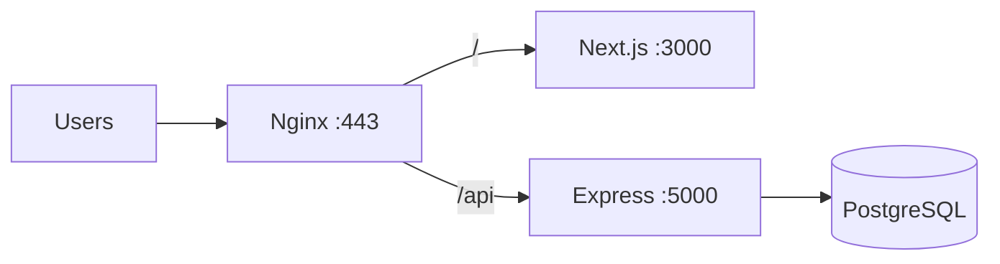

# Deployment Guide

[← Back to index](README.md)

## Overview

ModenixOS deploys as **two separate applications**:

| App | Recommended hosts | Build output |
|-----|-------------------|--------------|
| Server | Railway, Vercel, VPS + Node | `dist/server.js` |
| Client | Vercel, Netlify, VPS + Node | `.next/` |
| Database | Managed PostgreSQL (Railway, Supabase, RDS, etc.) | — |

No Docker or infrastructure-as-code is included in this repository.

---

## Pre-deployment checklist

- [ ] Change `SUPER_ADMIN_PASSWORD` from default
- [ ] Use strong random values for `BETTER_AUTH_SECRET`, `ACCESS_TOKEN_SECRET`, `REFRESH_TOKEN_SECRET`
- [ ] Set `NODE_ENV=production` on server
- [ ] Configure production `DATABASE_URL`
- [ ] Set production URLs: `BETTER_AUTH_URL`, `FRONTEND_URL`, `BACKEND_URL`
- [ ] Match `ACCESS_TOKEN_SECRET` on client and server
- [ ] Configure Cloudinary, SMTP, payment providers
- [ ] Run `npm run db:migrate:deploy` on server
- [ ] Register Stripe webhook: `POST {BACKEND_URL}/api/v1/billing/webhook`
- [ ] Register SSLCommerz callback URLs (see `sslcommerz.config.ts`)
- [ ] Update Google OAuth redirect URI for production domain

---

## Server deployment

### Step 1: Build

```bash
cd modenixos-server
npm ci
npm run build
```

### Step 2: Environment

Set all required variables (see [Environment Variables](04-environment-variables.md)). On hosted platforms, use the provider's secrets UI.

### Step 3: Database migration

```bash
npm run db:migrate:deploy
```

### Step 4: Start

```bash
npm start
# or: node dist/server.js
```

The server listens on `process.env.PORT` (Railway/Vercel set this automatically) or `PORT` from `.env`.

### Vercel (server)

`vercel.json` is included:

- Entry: `dist/server.js`
- Includes Prisma generated client and email templates
- Set `VERCEL=1` — server exports app without listening (serverless)

> Verify Prisma + PostgreSQL connection pooling for serverless (e.g. connection limit, `pgbouncer`).

### Railway

`server.ts` reads `process.env.PORT` — compatible with Railway's dynamic port assignment.

---

## Client deployment

### Step 1: Build

```bash
cd modenixos-client
pnpm install
pnpm build
```

### Step 2: Environment

| Variable | Production example |
|----------|-------------------|
| `NEXT_PUBLIC_API_BASE_URL` | `https://api.yourdomain.com/api/v1` |
| `NEXT_PUBLIC_BASE_URL` | `https://yourdomain.com` |
| `ACCESS_TOKEN_SECRET` | Same as server |

### Step 3: Start

```bash
pnpm start
```

### Vercel (client)

Standard Next.js deployment. Set environment variables in project settings.

---

## DNS & reverse proxy (manual VPS)

If using Nginx or similar (**not included in repo**), typical setup:



Example considerations (not shipped):

- Terminate TLS at Nginx
- Proxy `/api/v1` and `/api/auth` to backend
- Proxy `/` to Next.js
- Set `cookie` domain and `sameSite` for cross-subdomain auth if API and client are on different subdomains
- WebSocket not required for this app

---

## Post-deployment verification

| Check | Expected |
|-------|----------|
| `GET /health` | `{ database: "connected" }` |
| Client loads | Landing page renders |
| Login | Cookies set, dashboard accessible |
| Storefront | `/store/{slug}` loads for published store |
| Stripe webhook | Test event in Stripe dashboard |
| SSLCommerz | Sandbox transaction completes |
| Email OTP | Registration email received |

---

## Related documentation

- [Installation](03-installation.md)
- [Environment Variables](04-environment-variables.md)
- [Security](13-security.md)
- [Backup & Recovery](12-backup-recovery.md)
