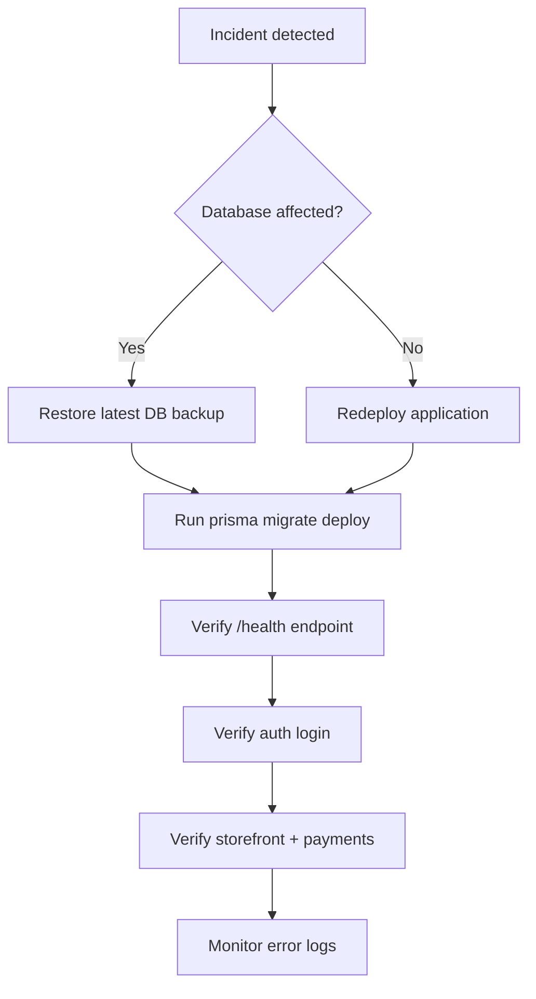

# Backup & Recovery

[← Back to index](README.md)

## What to back up

| Asset | Location | Priority |
|-------|----------|----------|
| PostgreSQL database | Hosted provider | **Critical** |
| Cloudinary media | Cloudinary account | **High** |
| Environment secrets | Secrets manager / `.env` | **Critical** |
| Prisma migrations | `modenixos-server/prisma/migrations/` | Medium (in source control) |
| Application source | Repository | Medium (in source control) |

---

## Database backup

### Recommended approach

Use your PostgreSQL provider's automated backup feature:

| Provider | Typical feature |
|----------|-----------------|
| Railway | Automatic daily backups |
| Supabase | Point-in-time recovery |
| AWS RDS | Automated snapshots |
| Self-hosted | `pg_dump` cron job |

### Manual backup (pg_dump)

```bash
pg_dump -h localhost -U postgres -d modenixos_db -F c -f modenixos_backup_$(date +%Y%m%d).dump
```

### Restore

```bash
pg_restore -h localhost -U postgres -d modenixos_db --clean modenixos_backup_YYYYMMDD.dump
```

After restore, verify:

```bash
cd modenixos-server
npm run db:migrate:deploy  # Ensure schema is current
curl http://localhost:5000/health
```

---

## File / media backup

Uploaded images and PDFs are stored in **Cloudinary**, not on the server filesystem.

- Enable Cloudinary backup/add-on or periodic export via Cloudinary Admin API
- Document `APP_UPLOAD_FOLDER` prefix for recovery scoping

---

## Secrets recovery

Maintain an offline encrypted copy of production environment variables:

- Database URL
- Auth secrets (`BETTER_AUTH_SECRET`, JWT secrets)
- Cloudinary credentials
- SMTP credentials
- Stripe and SSLCommerz keys
- `OPENROUTER_API_KEY`

**Never commit secrets to git.**

---

## Disaster recovery procedure



### Recovery time objectives

Not formally defined in codebase. Suggested targets for operations:

| Tier | RTO | RPO |
|------|-----|-----|
| Database | < 4 hours | < 24 hours (daily backup) |
| Application | < 1 hour | Redeploy from git |
| Media (Cloudinary) | Provider-dependent | Provider-dependent |

---

## Related documentation

- [Deployment](11-deployment.md)
- [Security](13-security.md)
- [Database](06-database.md)
